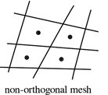

# OpenFoam® Handbook

## Preface

This handbook is intended to support a medium/advanced OpenFoam® user
during the usage of the software. It provides commands, explanations,
and extension that we find useful during our CFD workflow, and it is
designed to be used by searching for keywords of an action you wish to
perform within the OpenFoam® framework. This allows you to enrich or
resolve the setting of a problem in the shortest possible time.

## Where is it hosted

The book is hosted at: http://18.168.113.177:3000/

## Table of Contents

[Preface](#preface)

[1 Installation](#installation)

  - [1.1 Via package manager](#via-package-manager)

  - [1.2 Compiling the source code for x86 architecture](#compiling-the-source-code-for-x86-architecture)

  - [1.2.1 Compiling source code for raspberry pi 4 (ARM architecture)](#compiling-source-code-for-raspberry-pi-4-arm-architecture)

[2 Problem set up ](#problem-set-up)

[3 Automation ](#automation)

  - [3.1 Run commands in sequence](#run-commands-in-sequence)

  - [3.2 Create a custom command](#create-a-custom-command)

  - [3.3 Bash script](#bash-script)

[4 Useful command](#useful-command)

  - [4.1 Find file in tutorial](#_Toc95420194)

[5 Mesh](#mesh)

  - [5.1 blockMesh](#blockmesh)

  - [5.2 SnappyHexMesh](#snappyhexmesh)

    - [5.2.1 Most important mesh parameters](#_Toc95420198)

    - [5.2.2 Advice for internal flow](#advice-for-internal-flow)

    - [5.2.3 Setting zones inside the mesh for source terms](#setting-zones-inside-the-mesh-for-source-terms)

    - [5.2.4 Advanced refinement technique](#advanced-refinement-technique)

    - [5.2.5 Meshing more than one close body](#meshing-more-than-one-closed-body)

    - [5.2.6 Parallelization issues](#parallelization-issues)

  - [5.3 cfMesh ](#cfmesh)

  - [5.4 checkMesh](#checkmesh)

  - [5.5 ANSYS Meshing to OpenFoam® ](#ansys-meshing-to-openfoam)

[6 Directories’ structure](#directories-structure)

[7 – 0 (i.e. Boundary Conditions)](#i.e.-boundary-conditions)

  - [7.1 ε, ω, k](#ε-ω-k)

    - [7.1.1 Internal Flow approximations](#internal-flow-approximations)

    - [7.1.2 External flow applications](#external-flow-applications)

    - [7.1.3 Turbulent Wall functions](#turbulent-wall-functions)

  - [7.2 nut](#nut)

    - [7.2.1 Turbulent viscosity wall functions](#turbulent-viscosity-wall-functions)

[8 Constant](#constant)

  - [8.1 transportProperties](#transportproperties)

  - [8.2 polyMesh ](#polymesh)

     - [8.2.1 boundary](#boundary)

  - [8.3 Thermophysical model](#thermophysical-model)

[9 System ](#system)

  - [9.1 controlDict ](#controldict)

  - [9.2 fvSchemes ](#fvschemes)

    - [9.2.1 Discretization schemes selection](#discretization-schemes-selection)

  - [9.3 fvSolution](#fvsolution)

    - [9.3.1 linear solver](#linear-solver)

    - [9.3.2 solver](#solver)

    - [9.3.3 Residuals](#residuals)

    - [9.3.4 Under-relaxation factors](#under-relaxation-factors)

  - [9.4 decomposeParDict](#decomposepardict)

  - [9.5 fvOptions](#fvoptions)

[10 Problem initialization and interpolation from previous results](#problem-initialization-and-interpolation-from-previous-results)

[11 Browse Source Code](#browse-source-code)

[11.1 Doxigen](#doxigen)

[11.2 Source code](#source-code)

[12 Multiphase model](#multiphase-model)

[13 Conjugate Heat Transfer Model](#conjugate-heat-transfer-model)

  - [13.1 Run in parallel a CHT model](#run-in-parallel-a-cht-model)

[14 Run in parallel](#run-in-parallel)

[15 Residuals](#residuals-1)

  - [15.1 Convergence](#convergence-advice)

  - [15.2 pyFoam](#with-pyfoam)

[16 ParaView](#ParaView)

  - [16.1 Post processing in ParaView Error\! Bookmark notdefined.](#_Toc95420243)

  - [16.2 pvserver](#pvserver)

  - [16.3 Installation from source code Error\! Bookmark notdefined.](#_Toc95420245)

  - [16.4 Trouble shooting](#trouble-shooting-common-problems)

[17 Post processing via command line](#post-processing-via-command-line)

[18 Cluster practice](#cluster-practice)

[19 Compile functionObjects from web](#compile-functionobjects-from-web)

[20 Windows-practices](#windows-practices)

  - [20.1 WSL](#WSL (Windows Subsystem for Linux))

  - [20.2 NotePad ++](#notepad)

[22 Multipass](#multipass)


# Installation

The installation of OpenFoam® is possible through three methods:

  - Directly installing the binary file from packages manager

  - Extracting the already compiled package from the OpenFoam® websites

  - Compiling from the source code

## Via package manager 

To check the dependencies (other software needed to run OpenFoam® )) the
suggested software and the description of the package:

```console
apt show openfoam
```
Then install it

```console
apt install \ ***`OpenFOAMVersion**` 
```

## Compiling the source code for x86 architecture 

Source code needed to compile it, it is usually retrieved via git with
the command git clone \<\>:

  - OpenFOAM-\<OpenFOAMVersion\>

  - ThirdParty-\<OpenFOAMVerision\>

Install the source code in the installation directory /otp/, so the
binaries, libraries, and configuration will be in the same directory.
They will not be separated into different locations as a traditional
UNIX system would have them. To check if your system has an adequate
environment to start the installation run:

```console
source /opt/\<OpenFOAMInstallationPath\>/etc/bashrc
foamSystemCheck
```
If the system check did not produced error messages, then OpenFOAM can
be compiled. This is done by executing ./Allwmake. This is an
installation script that takes care of all required operations.
Compiling OpenFOAM can be done by using more than one processor to save
time. In order to do this, an environment variable needs to be set
before invoking ./Allwmake.

```console
export WM\_NCOMPPROCS = 4
```

then proceed with the compilation:

```console
./Allwmake -j -s -q -l
```
If you have an HPC or you can schedule the installation with this bash
script

After the source code has been compiled, it is good practice add those
lines in  \~/.bashrc :

```console
source \<installationDirectory\>/etc/bashrc
```
```console
source ${WM\_PROJECT\_DIR:?}/bin/tools/RunFunctions
```
So, at the next start-up (source \~/.bashrc), the OpenFoam® commands
will be recognized in the terminal

### Compiling source code for raspberry pi 4 (ARM architecture)

Create a file \<installationPath\>/etc/prefs.sh in the installation
directory as shown:

```console
echo "WM\_COMPILER=Gcc" \> etc/prefs.sh
```

Change two files (cOpt and c++Opt) in wmake/rules/linuxARM7Gcc,
substituting the option -mfloat-abi=softfp into -mfloat-abi=hard

Then
```console
source \<installationPath\>/etc/bashrc
```
Then start the compilation with:
```console
./Allwmake -j -s -l
```
\-j flag stands for --> use all the processor available

# Problem set up 

Select an appropriate solver for the problem:

ls $FOAM\_SOLVERS

Once it is decided a solver, take the tutorial case, copy a suitable
tutorial to your working directory

cp -r $FOAM\_TUTORIALS/\<tutorial\> $FOAM\_RUN

Modify the tutorial, including geometry, meshing and problem setup. If
you need to set a specific directory which is not present in the
tutorial you have chosen, this utility will create the dictionary for
you:
```console
foamGetDict \<dictionary you are searching\>
```
For instance:
```console
foamGetDict topoSetDict
```
# Automation 

## Run commands in sequence 

Sequence of commands Command 2 will start only if command 1 has succeeded:
```console
\<Command1\> && \<Command2\>
```
Piping commands → The output of Command 1 will feed Command 2 as argument
```console
\<Command1\> | \<Command2\>
```
Using ; permit to run command in sequence even if the precedent fail
```console
\<Command1\>; \<Command2\>
```
## Create a custom command

Open the file \~/.bashrc and write at the end of this file the command
you need following this layout

alias \<nameCommand\>=’\<list of command you want execute digiting
nameCommand\>’

For example, a useful alias which create a dummy file with the name of
the directory and then open ParaView in series:
```console
alias ParaView ='touch "${PWD\#\#\*/}".foam && ParaView "${PWD\#\#\*/}".foam
```
## Bash script 

These are script files, for running all the commands related to the
case. You can open it using any editor and see the commands in it.
Tanking as an example the native bash script often present in tutorial
cases:

```console
./Allrun
```
It will run all the command necessary to run the tutorial

```console
./Allclean 
```
It will run all the command necessary to clean the tutorial.
To write you bash script, start a new file with the notation:

```console
#!/bin/bash 
```
in the first row and then followed by the command you want to execute
Elevate the file permission adding execution permission through

```console
chmod +x \<fileName\>
```
For running your bash script, type:
```console
./\<fileName\>
```
# Useful command 

Grep will search word for you in selected documents or a list of them

```console
grep -w -R "car\_baseCase" \*
```
where -w stands for word and -R for research in subdirectories

Rename more than one file at once, extension included

```console
mmv '\*.STL' '\#1.stl'
```
To check running simulation written in a log file, it is possible to see
in terminal the live writing

```console
tail -f \<log.fileName\>
```
To copy a file in different directory, execute:

```console
ls -d processor\* | xargs -i cp -r 0.orig/\* ./{}/0
```
Call a GUI file manager from terminal (nautilys is the defult in GNOME
desktop envirnments) :

```console
nautilus . &
```
For replacing the text repetitively in file stream:

```console
find . -type f | xargs sed -i s/\<oldWord\>/\<newWord\>/g
```
To find Find the correct case in tutorial

```console
find $FOAM\_TUTORIALS -name controlDict | xargs grep -r \<word1\>
```

List controlDict files where word1 have been found

# Mesh

Mesh in OpenFoam can be generated with 3 native tools, a combination of
those or translated from other programmes.

## blockMesh

First step is to create a dummy folder with the tutorial command:

```console
restore0Dir
```
BlockMesh is the basic mesh generators which relies on a single
dictionary file system/blockMeshDict with the command:

```console
blockMesh
```

Theg mesh will be generated inside the folder constant/polyMesh.
Parameters to control this command is in system/blockMeshDict which
defines the domain through vertices, define the blocks and set the
number of elements in the segment (be consistent – side of different
block must be the same grid refinement and bias)

In blockMesh.boundary, use the rule of the right hand to create the
normal to the surface towards the intern of the body.

## SnappyHexMesh

In order to define the patches in snappyHexMesh you need to use
different STL file that can couple in a watertight geometry. Use the
utility surfaceCheck to proof that your STL is watertight.

The files to entry in the command are the parts of the 3D complex draw
in STL format (exclusively written in ASCII) and they must be copied in
constant/triSurface. Then modify the file sytem/surfaceFeatureDict
substituting and adding the entries and modifying the featured angles
(170°(advised) - 180°: you include all the angle between two neighboured
cells, lowering this value it wouldn’t be consider these cells and it
will be applied a merged cell)

```console
surfaceFeatureExtract
```

The geometry components must be costant/triSurface directory rigorously
in this format \<file\>.stl and after having launched the command in
the same folder should appear \<file\>.eMesh and a new directory
will appear in constant/extendedFeatureEdgeMesh/

If you want to extract very thin layer, use the utility extrudeMesh
dependent on the dictionary extrudeMeshDict to extrude some layers
externally to the geometry, however, make sure that those created are
very thin.

<table>
<thead>
<tr class="header">
<th>snappyHexMesh -overwrite</th>
<th><strong>Single core</strong></th>
</tr>
</thead>
<tbody>
<tr class="odd">
<td><p>decomposePar</p>
<p>mpirun -n 16 snappyHexMesh -parallel -overwrite</p>
<p>reconstructParMesh -latestTime -constant</p></td>
<td><strong>Parallel process </strong></td>
</tr>
</tbody>
</table>

If you want to mesh to separate mesh, run twice snappyHexMesh with
different value of Location in mesh and then use the tool mergeMesh

### Advice for internal flow 

To fix the boundary conditions, prepare watertight STL files as
inlet.stl, outlet.stl, ect. Then in snappyHexMesh define it in geometry
section
```c++
geometry
{
    inlet.stl
    {
        type triSurfaceMesh;
        name inlet;
    }
        outlet.stl
    {
        type triSurfaceMesh;
        name outlet;
    }
}

```
While in the refinement surfaces section you can define the address the
info of the patch:
```c++
refinementSurfaces
    {
        inlet
        {
            
            level (2 2);
            patchInfo
                        {
                        type patch;
                        }
        }
        outlet
        {
            
            level (2 2);
            patchInfo
                        {
                        type patch;
                        }
        }
        wall
        {
            
            level (2 2);
            patchInfo
                        {
                        type wall;
                        }
        }
}
```

### Setting zones inside the mesh for source terms 

Sets and Zones, can store any mesh entity (point, face or cell) in a
data structure that is somewhat similar to a list. The major difference
is in the internal handling of the mesh entities, especially in the case
of a parallel simulation with topological mesh changes. In this case,
the addressing in the list has to be updated accordingly and only the
zone provides such a method (use cellZone for this purpose).

  - pointSet/faceSet/cellSet provide a named list of point/face/cell
    indexes. Essentially, it's just the result of a selection of
    points/faces/cells, so that you can then do something with them,
    since you know which ones you want. Usually, these sets are used for
    data sampling and for creating faceZones or cellZones

  - cellZone are an extension to the sets, since zones provide
    additional information useful for mesh manipulation. Zones are
    commonly used for MRF, baffles, dynamic meshes, porous mediums and
    other features available through the dictionary system/fvOptions

Sets can be used to create Zones and vice versa. As a reminder first
create a cellSet and then fed the cell set into the creation of the
cellZone to use fvOptions

The selection is usually performed by the tools, both of which can
select subsets of the mesh and perform boolean operations on them

  - setSet --> Use an interactive window

  - topoSet --> Use a dictionary in system/topoSetDict

Example of topoSet for the implementation of 2 cellZones from STL files:

```c++
FoamFile
{
    version     2.0;
    format      ascii;
    class       dictionary;
    location    "system";
    object      topoSetDict;
}
// * * * * * * * * * * * * * * * * * * * * * * * * * * * * * * * * * * * * * //

actions
(
    {
        name    HE_frontCellSet;
        type    cellSet;
        action  new;
        source  searchableSurfaceToCell;//surfaceToCell;
        surfaceType  triSurfaceMesh;
        surfaceName    HE_front.stl; 
    }
    {
       name HE_front;
       type cellZoneSet;
       action new;          // new cellSet, it doesn't simply add to a previous cellSet
       source setToCellZone;//zoneToCell;
       set  HE_frontCellSet;
       

    }
    {
        name    HE_frontLateralCellSet;
        type    cellSet;
        action  new;
        source  searchableSurfaceToCell;//surfaceToCell;
        surfaceType  triSurfaceMesh;
        surfaceName    HE_frontLateral.stl; 
    }
    {
       name HE_frontLateral;
       type cellZoneSet;
       action new;   // new cellSet, it doesn't simply add to a previous cellSet
       source setToCellZone;//zoneToCell;
       set  HE_frontLateralCellSet;
    }
);
```

To visualize how much Cell Zone there is inside the domain run
checkMesh, while if you desire to delete a cell zone, delete the files
that topoSet creates which are located in: constant/polyMesh/sets

### Advanced refinement technique 

The necessity to refine area that sometimes require a complex shape can
be satisfied through the usage of an STL file as a cellZone entry.
First, define a closed STL file through snappyHexMeshDict.geometry then
use this frame in the respective snappyHexMeshDict sector

```c++
    refinementSurfaces
    {
        <closeSTLFileYouWantToRefine>
        {
            level (1 2);
            
            cellZone <\name\>;
            faceZone <\name\>;
            cellZoneInside inside;
        }
      …
    refinementRegions
    {
        <closeSTLFileYouWantToRefine>
        {
            mode <\mode\>;
            levels ((0.000008 3));
        }
    }
```

### Meshing more than one closed body

To permit the recognition of different closed STL files the
sub-dictionary snappyHexMesh/castellatedMeshControls/locationInMesh must
be modified in snappyHexMesh/castellatedMeshControls/locationsInMesh and
follow the template:

```c++
    …
   locationsInMesh 
      (
        ((0.010276 0.058958 0.000248) zone1) 
  	    ((0.011472 0.10046  0.000256) zone2)
       );
   …
```

In this scenario, it is possible to introduce to bodies as a single mesh
without recurring to use the utility mergeMeshes. The bodies will be
distinguished from a different cellZones allocations.

### Parallelization issues 

If you forgot to restore the 0 directory before the case decomposition,
what you can do is tp reconstruct the mesh and decompose it again with
the 0 folder in place with:

```console
reconstructParMesh -constant
```
```console
decomposePar -force
```
When is reconstructed only the mesh, and the redecomposed to include the
0 dir. and error can occur when triyng to reconstruct the concluded case
at the end. A solution is to run:

reconstructParMesh -constant && reconstructPar -latestTime

## cfMesh

CfMesh is a mesher which is integrate in OpenFOAM® such as
SnappyHexMesh. and it is possible to find the tutorial relatives to it
in:

```console
\<OpenFOAMInstallationDirectrory\>/modules/cfmesh/tutorials
```

The modalities to create a mesh pass always through the creation of .stl
bodies as boundaries, i.e. create all different .stl file as surface
(ASCII and divided per patch that you intend to apply a boundary
condition)

```console
cat \<body1\>.stl \<body2\>.stl \<bodyN\>.stl \>\>\<combined\>.stl
```
to permit at the program to select different patches of the geometry,
remember to check inside the combined file and ensure there is a space
between the joint of the different STL files. Then to create a .fms file
specific for OpenFoam®

```console
surfaceFeatureEdges –angle 15 \<combined\>.stl \<combined\>.fms
```

The tag angle \<number\> permit to capture correctly sharp corner of
the geometry and more it is low more it will be precise and
computationally expensive, I found 15 being a good compromise, the
default is 45. Secondly, to set the boundary condition in the easiest
way, open the .fms file (OpenFOAM format) to change the type of
boundaries (wall, patch, empty) in the first rows. Then the following
modifications acts on the dictionary system/meshDict. Then to run the
cited dictionary type the command:

```console
cartesianMesh
```

For command to run require that the directory system/meshDict contain
only the voice:
```c++
surfaceFile "…";

maxCellSize "…";
```
If you are not satisfied with the result, try to run these utilities to
improve the results:

```console
improveMeshQuality
```

## checkMesh

checkMesh will look for/check for:

  - Mesh stats and overall number of cells of each type.

  - Check topology (boundary conditions definitions).

  - Check geometry and mesh quality (bounding box, cell volumes,
    skewness, orthogonality, aspect ratio, and so on).

If for any reason checkMesh finds errors (errors must be repaired), it
will give you a message and it will tell you what check failed, writing
a set with the faulty cells, faces, and/or points In the directory
constant/polyMesh/sets/

To check all the parameters (often an overkill utilities) of the mesh
like quality parameters run:

```console
checkMesh -allGeometry -allTopology -writeAllFields -writeSets vtk
``` 

This additive options permit to visualise all the fields and most of the
time is impossible to make them have a positive outcome, hence a simple:

```console
checkMesh -writeSets vtk
```

Will write to constant/polyMesh/sets/ the Sets to permit to check the
most important features cellZones in your domain via ParaView

As advice to improve the quality of the mesh try to remove as much as
possible tetrahedra and tet wedges. Then is very important to check
minVolume (if it is negative, check you STL or
setting)<span id="_Toc95420198" class="anchor"></span>

### Most important mesh parameters

The most important parameters to keep under control when we deal with mesh genration are:

| Non orthogonality | Not run a case if it is above 80 |  |
| --------------------- | -------------------------------- | ------------------------------------------------------ |
| Skewness          | Acceptable under 3               |  |

### Deletion of bad quality cells

You can delete bad cells if they are not in region of interest, if this
is the case utilities such as setSet and subsetMesh can be useful tools,
otherwise it is strongly advised to re-mesh.

After checking the quality and writing the problematic cells in cellSets
with:

```console
checkMesh -allTopology - allGeometry
```

It is possible to delete the problematic cells with the utility:

```console
setSet -constant
```

An internal command line will appear, and similar command can be used to
manage bad cells present in your mesh (i.e. concave, underdetermined,
zero volume cells), in this example zero volume cells are treated:
```console
cellSet c0 new cellToCell zeroVolumeCells any
```
if you want to fix additional cells and with problematic faces you can
(i.e. skew, concave, warp faces etc..)
```console
cellSet c0 add faceToCell skewFaces any
```


In the end do not forget to invert, with:
```console
cellSet c0 invert && quit
```
Once exited from the internal command line, execute the following
command to overwrite the mesh

```console
subSetMesh c0 -overwrite
```
## ANSYS Meshing to OpenFoam® 

OpenFoam® needs to read a mesh in ASCII format if it comes from another
program so to export a Fluent .msh file in ASCII format the shortest way
(from ANSYS meshing) is:

File → Option → Meshing → Export → Format of input file (.msh)

Choose ASCII and then you can easily extract the file in ASCII format by
exporting the mesh. After you have the file in the working directory,
the addressed command is

```console
fluentMeshToFoam \<fileName\>.msh
```

Remember that it is good practice check the boundary setting in
constant/polyMesh/boundary after a conversion

# Directories’ structure
The following represaentation is the usual set up for an OpenFoam® case 


# – 0 (i.e. Boundary Conditions)

The BC works on the Patches which have been defined in the mesh and the
guessing of the first value of the field pass through the voice

```c++
internal field
```
which can be filled with a uniform, but it could be changed in
non-uniform if set values in system/setFieldsDict and then apply this
change through setFields

Type of patches are:

- fixedValue

- zeroGradient

- symmetryplane

- noSlip

- empty  (to set a 2D simulation)

- AMIcyclic (impose a periodic BC when the patches in study have not the
same mesh, it must be declared the nature of periodicity (rotational,
translation). The separationVector must contain the distances between
the 2 patches in study. It is advised to use a createPatchDict to modify
the BC after snappy procedure of snappyHexMesh because can cause
problems to the patches)

- calculated – calculate the value from its component in the field, this
doesn’t work for transport quantities but only for variable define by a
formulae (for instance nut)

- totalPressure – which is a fixedValue condition calculated from p and U
field

- pressureInletOutletVelocity – which applies a zeroGradient on all
components, except where there is inflow, in this case a fixedValue
condition is applied to the tangential component

- inletOutlet: which is a zeroGradient condition when outwards, fixedValue
when flow is inwards

```c
  {
    type inletOutlet;
    inletValue uniform (0 0 0); // value of the velocity
    value uniform x;            // value of the properties
  }
```

Basically, inletOutlet is zero gradient unless the flow is inward in
which case it is fixed value (inletValue). outletInlet is zero gradient
if the flow is inward and fixed value (outletValue) if the flow is
outward.

## ε, ω, k 

An estimation of the turbulent mainstream quantities should take place
to have a stable solver:

### Internal Flow approximations 

For a fully developed inlet flow, approximating turbulent boundary
conditions can be extrapolated using the Reynolds number *Re* to
determine the turbulent intensity *I* to define the intensity length
scale *l*, the required turbulent boundary conditions can be calculated.

$ I = 0.16 \ Re_L ^{-1/8} $

This can be used to calculate a mean approximation for the turbulent
boundary conditions

$ k = \frac{3}{2} U I^{2} $

$ ε = C_{\mu}\frac{k^{\frac{3}{2}}}{l} = C_{\mu}\frac{k^{\frac{3}{2}}}{0.07L} $

$ ω = \frac{\varepsilon}{kC_{\mu}}\ $

### External flow applications 

External flows can be a bit tricky to approximate because it is hard to
evaluate the flow downstream considering anything that could have
affected the turbulence. This could be other objects, convection over
land or the position of the domain in a boundary layer. A good technique
for approximation turbulence is by using the Turbulent Viscosity
Ratio—the ratio between molecular viscosity and turbulent viscosity.
This ratio can be used along with the Turbulence Intensity, freestream
velocity and molecular viscosity to determine k, ε and ω using the
following technique. To start the calculation, the Turbulent Intensity
I, and Viscosity Ratio β need to be approximated by using the table
below.

To calculate k, the following equation can be used:


  $ k = \frac{3}{2}\left( \text{UI} \right)^{2} $

  $ ε = C_{\mu}\frac{\text{ρk}^{2}}{\mu}β ^{- 1}\ $

  $ ω = \frac{ρk}{\mu}\ β^{-1}\ $


### Turbulent Wall functions

Keeping the focus only in the treatment of the wall, the corresponding
wall functions exist:

\- εWallFuncion for ε( (fixed value e=0 or better e=1e-8(?) for lowRe
calculations):

calculate (for each timestep) the first grid point value by using an
algebraic expression derived from the classical logarithmic law-of the
wall approach

\- kqRWallFunction for k, q, R

in code: Boundary condition for turbulence k, Q, and R when using wall
functions. Simply acts as a zero-gradient condition. It appears to be
applicable down to yPlus\~1, but one should use a fixed value with k=0
or a very small value for y<sup>+</sup>\<1)

\- omegaWallFunction for omega; Not really a wall function but the b.c.
defined by Menter for Omega, i.e. should be used always for kOmega
model, independent of y<sup>+</sup>)

omegawall=60\*nu/(β \*y+<sup>2</sup>), with nu=kinematic viscosity at the wall,
β =0.075 and y<sup>+</sup>normal distance between the first fluid node and the
nearest wall-\> very large value for omega)

The "value" which is specified for the wall functions is only an initial
condition

## nut - $ ν_{t} $

The entries for $ ν_{t} $ are type calculated because they come from ε and k
to calculate the field. Instead in the wall, you specify a wall function
for $ ν_{t} $, to modify the momentum equation for the cells adjacent to the
wall. The modification is that OpenFoam® calculates wall shear stress
from log-law for these cells and put it in their equations. OpenFoam®
does not use log-law directly to obtain next-to-the-wall cell velocities
but solves their equation in which the stress term is modified using
log-law. For more information see 1 and 2 below p.51 and p.714
respectively.

### Turbulent viscosity wall functions

The choice of wall function model is specified through the turbulent
viscosity field  $ ν_{t} $ in the 0/nut dictionary by the nutxxxxxx
wall functions:

  - nutWallFunction seems to be the most basic wall function without
    further requirements: high-Re wall-function based on k.

  - nutkWallFunction standard for k-ε/k-ω, it calculates the turbulent
    viscosity in the first node point based on the logarithmic law based
    on the k value close to the wall

  - nutUWallFunction: in comparison to nutkWallFunction it calculates the y<sup>+</sup>sup>+</sup> yPlus value based on the velocity close to the
    wall

  - nutUSpaldingWallFunction standard wall function for the Spallart
    Allmarras turbulence model, called nutSpalartAllmarasWallFunction, continuous wall-function which should cover the complete y<sup>+</sup> range from O(1) to somewhere of O(10). Might be the best choice (together with low Re k-ε, k-ω, or SA, when y<sup>+</sup> varies for different parts of the wall.

  - nutLowReWallFunction (code comment: "Sets $ ν_{t} $ to zero and provides an access function to calculate y<sup>+</sup>."):

# Constant 
Looking at the directories that represent the constant variable of the CFD case in ```/constant``` 

## transportProperties

nu is the kinematic viscosity i.e.

$ ν_{\text{air}} = \frac{µ}{\rho} = 1.48 \times 10^{- 5}\ \frac{m^{2}}{s}\ $

Air kinematic viscosity at given temperature

##  polyMesh

Contains all the mesh details

### boundary

Each patch can be put inGroups for pre and post-processing purpose. Each
patch can thus be in several groups. The patchGroup generated by this
makes e.g. setting of boundary conditions easier. A patch boundary
condition definition takes precedence over a patchGroup boundary
condition.

### sets

Each set you will create (through checkMesh. topoSet, setSet) it will be
stored in this document diversifying between:

  - pointZone

  - faceZOne

  - cellZone

## Thermophysical model

The thermophysicalProperties dictionary is read by any solver that uses
the thermophysical model library.

Types of thermo class

- hePsiThermo: General thermophysical model calculation based on compressibility ψ = 1/(RT) - Only gas
- heRhoThermo: General thermophysical model calculation based on density ρ. Gas, liquid, solids
- heSolidThermo: Only solids

# System 

## controlDict

The time from where simulation starts (startFrom), the time when the
simulation finishes (stopAt), the time step (deltaT), the data saving
interval (writeInterval), the saved data file format (writeFormat), the
saved file data precision (writePrecision), and if changing the files
during the run can affect the run or not (runTimeModifiable) are set in
this file.

*Note*: If the write format is ASCII, then the simulation data which is
written to the file can be opened and read using any text editor. If the
format is binary, the data will be written in binary style and is not
readable by text editors. The advantage of binary over ASCII is the
smaller file size, and consequently faster conversion and writing to
disk, for big simulations.

## fvSchemes

This dictionary contains the instructions to discretize the problem’s
equations. Different discretization procedures suit different mesh
refinement and quality.

| Main document keywords | Category of mathematical terms                                                            |
| -------------------------- | --------------------------------------------------------------------------------------------- |
| interpolationSchemes       | Point-to-point interpolations of values                                                       |
| snGradSchemes              | Component of gradient normal to a cell face                                                   |
| gradSchemes                | Gradient          ∇|
| divSchemes                 | Divergence      ∇ ∙|
| laplacianSchemes           | Laplacian    ∇<sup>2 |
| timeScheme                 | First and second time derivatives ![∂∕ ∂t,∂2∕∂<sup>2<sup>t  |

gradScheme

This voice tackles the gradient limitators

divSchemes

Relates to the evaluation of the flux φ (phi) across cell faces which
transport a property \<transporProperties\> under the influence of
velocity field (phi). The schemes are all based on Gauss integration,
using the flux φ and the advected field being interpolated to the cell
faces by one of the selected schemes

These are the convective discretization schemes that you will use most
of the times:

  - Gauss upwind → first order accurate.

  - Gauss linearUpwind grad(\<transporProperties\>) → second order
    accurate, bounded.

  - Gauss linear → second order accurate, unbounded.

  - Gauss limitedLinear → second order accurate, unbounded, but more
    stable than pure linear. Recommended for LES simulations.

Gauss indicates derivatives are evaluated via Gauss’ theorem (no real
choice there). upwind is standard 1st order upwind interpolation
(usually too diffusive). linear is standard 2nd order interpolation –
unbounded. Instead remember that TVD methods (such as superBee, minmod
vanLeer) switch locally to upwind when they detect strong gradients

For the discretization of the diffusive terms, you can use a fully
orthogonal scheme

  - Linear corrected

  - Linear limited \<from0To1\>

0 for bad mesh and 1 for good quality mesh

### Discretization schemes selection

Non-orthogonality between 70 and 85

Non-orthogonality between 60 and 70

Non-orthogonality between 40 and 60

## fvSolution

Usually is divided in 3 parts: linear-solver, solver and
under-relaxation factor

### linear solver

Matrix solver which works on algebraic system of shape Ax=b;
referring to the method of number-crunching to solve a matrix equation.
The linear solver stops if any one of the following conditions are
reached:

  - tolerance Define the exit criterion for the solver, it is the
    absolute difference between 2 consecutive iterations and must be low
    in steady state while coarser in transient simulation

  - relTol Define the exit criterion for the solver, on a relative
    difference of solution from 2 consecutive iteration (i.e. 0.1 is
    10%)

  - maxIter A maximum number of iterations at which the solver is
    stopped anyway 1000 as default

### solver

The solver explicit the algorithm the linear system will be arranged to
go towards convergence such as \<pressure-velocity coupling SOLVER\>
(i.e. SIMPLE, PISO or PIMPLE)


Figure 2 - PIMPLE algorithm

All the algorithms solve the same governing equations, consequently they
differ in how they loop over the equations. The looping is controlled by
input parameters that are listed below. They are set in a dictionary
named after the algorithm

  - nNonOrthogonalCorrectors: used by all algorithms, specifies repeated
    solutions of the pressure equation, used to update the explicit
    non-orthogonal correction of the Laplacian term; typically set to 0
    (particularly for steady-state) or 1.

  - nCorrectors: used by PISO, and PIMPLE, sets the number of times the
    algorithm solves the pressure equation and momentum corrector in
    each step; typically set to 2 or 3.

  - nOuterCorrectors: used by PIMPLE, it enables looping over the entire
    system of equations within on time step, representing the total
    number of times the system is solved; must be and is typically set
    to 1, replicating the PISO algorithm.

  - momentumPredictor: switch those controls solving of the momentum
    predictor; typically set to off for some flows, including low
    Reynolds number and multiphase.

### Residuals

The residual is evaluated by substituting the current solution into the
equation, taking the magnitude of the difference between the left- and
right-hand sides; it is also normalised to make it independent of the
scale of the problem being analysed. Consequently, before solving an
equation for a particular field, the initial residual is evaluated based
on the current values of the field. After each solver iteration the
residual is re-evaluated. To terminate the case, the initial residual of
the field equations must falls below user-specified threshold values:

### Under-relaxation factors

Relaxation factors for under-relaxation of fields are specified within
a *field* sub-dictionary; relaxation factors for equation
under-relaxation are within a *equations* sub-dictionary. 

## decomposeParDict

This dictionary decomposeParDict divides the domain in blocks which will
be solved by a single core per each. It is advised to use schotch as
option for large case. Use the command:
```console
decomposePar -force
```
To overwrite the present decomposed case

## fvOptions

This dictionary defines properties allocable in the geometry such as
porosity value, temperature limiters, etc… It is enough writing the
document to have valid the criteria on the calculations, no need to run
a command in the terminal

# Problem initialization and interpolation from previous results

If it is not available any previous solution, run

```console
potentialFoam
```

to overwrite 0/U with an approximate solution of the field. Instead, to
map the solution from a coarse mesh to a finer mesh with different mesh
run

```console
mapFields -consistent -sourceTime \<iteration number\> \<path of the
base case\>
```
to interpolate the results. This will overwrite ./0 with the value of
the case interpolating the result in the mesh in interest. If you do not
specify -consistent it is necessary, build a mapFieldsDict.

To reorder the sparse matrix before launch the calculus

renumberMesh

# Browse Source Code

The best source of information is the source code and the Doxygen
documentation.

## Doxigen

The directory $WM\_PROJECT\_DIR/doc contains the Doxygen documentation
of OpenFoam® ). Before using the Doxygen documentation, you will need to
compile it. To compile the Doxygen documentation, from the terminal:

```console
cd $WM\_PROJECT\_DIR
./Allwmake doc
```

Note: You will need to install doxygen and graphviz/dot. After compiling
the Doxygen documentation you can use it by typing:

```console
firefox file://$WM\_PROJECT\_DIR/doc/Doxygen/html/index.html
```
The compilation is time consuming.

## Source code

The source code of the solver and governing equations solved are
described following the source code located in the directory
$FOAM\_SOLVERS


Other sources can be searched around. I.g: To find where the source code
for the boundary condition "slip" is located:

find $FOAM\_SRC -name "\*slip\*"

# Multiphase model 

Several solvers:

  - interFoam

In a multiphase simulation when you define the properties of the
interested fluids in constant/transportProperties

sigma: is the surface tension between at the interface

If you change the name of the fluid in phases (water air); there is the
need change the extension of the name as well in

0/alpha.\<nameOfTheFluid\>.

Even remember that the first material that you define in the first row
of this document will be taken as the first term of the VOF (volume of
fluid) equation.

<span class="underline">Warning</span>: In fvSolutions miss the keyword
cAlpha 1.0 to put in the section of alphaWater.\*

## twoPhaseEulerFoam


# Conjugate Heat Transfer Model

Several solvers:

  - chtMultiRegionFoam

  - chtMultiRegionSimpleFoam → steady state version of chtMultiRegionFoam

Allows for defining multiple regions in the problem domain by setting up
computational meshes, models and conditions separately for each region,
including solid-only (metal) ones. The steady-state flow and heat
transfer in the complete domain is obtained by solving the mass,
momentum and energy conservation equations simultaneously in all
regions, including the thermal coupling among them.

Create the mesh

Use topoSet (dependent on topoSetDict) to set different cellZones in
your domain

Then split the mesh to create interfaces and different body with the
following

```console
splitMeshRegions -cellZonesOnly -overwrite
```
And generate the
```console
changeDictionary -region \<region1\>
```
```console
changeDictionary -region \<region2\>
```
Follow the following tutorial to set up a case:

Check the constant/water/thermophysicalProperties, in the
thermophysicalProperties.thermo.type you should find heRhoThermo for the
fluid region and heSolidThermo for the solid region.

## Thermal boundary conditions

Instead as BC in 0, for selecting the thermal conductivity aside of
kappaMethod you need to introduce the keywords:

  - lookup: the used thermal conductivity is specified in the own
    boundary field by means of the name kappa. kappa is the name of the
    field.

  - fluidthermo: the used thermal conductivity is the one corresponding
    to the fluid, specified in \<material\>/thermophysical

  - solidthermo: the used thermal conductivity is the one corresponding
    to the solid, specified in \<material\>/thermophysical

  - directionalSolidThermo: the thermal conductivity is the one
    corresponding to an orthotropic material, and it is specified in
    \<material\>/thermophysical (directionalKSolidThermoCoeffs)

For introducing thin walls:

```c
thicknessLayers ( \<thicknessOfTheLayer\> );
kappaLayers ( \<thermalConductivityOfTheLayer\> );
```
Check the constant/\<region\>/polyMesh/boundary on to check the
interface type which should be of this kind type: solidThermo for the
solid and type: fluidThemo for the fluid. Other than that, it is
necessary that the interface will be declared as

type: mappedWall

# Run in parallel

After having complete the decomposition of the domain through
system/decomposePar the following command does the same action, where
process is intended either as solver or mesher:

```console
mpirun -np \<cores\> \<process\> -parallel \> log.\<fileName\> &
```
```console
foamJob -parallel \<process\>
```
To take full advantage of the hardware, use the maximum number of
physical cores, remember to disable the hyperthreading in the machine.
The output of the previous command writes a log file that records
either events thatoccur in the macine to monitor the simulation.
```console
tail -f log.\<fileName\> Live scrolling
```
```console
tail -\<linesToDisplay\> log.\<fileName\> Static scrolling
```
When the simulation is finished, all you time-step/iteration are in the
processor’s folder, to build a single case the following command it is
needed:
```console
reconstructParMesh
reconstructPar
```
If you need to kill the process in parallel, check top at first and the
execute:
```console
pkill \<processName\>
```
if for some reason the process does not close, given the fact OpenFOAM processes
are not vital for the system you can force the kill using :

> kill -9   
## Run in parallel a CHT model

To decompose a case with more than one region it is opportune to run
this shell script in a way that you correctly distribute the regions
between the processors:

And the decompose the case through:
```bash
decomposePar -allRegions
```

Remember to create symbolic link to all your
```bash
/system/\<region>/decomposeParDict -\> system/decomposeParDict
mpirun -n \<nProcessors> \<solver> -parallel
```
# Residuals 

## With GNUPlot

GNU Plot must be installed, and creating a file: /system/residual

called in /system/controlDict in this way

Then run:

```console
foamMonitor -l ./postprocessing/0/residuals
```

## With pyFoam

If you want to see your residual live just install a python environment,
and then with the command:

```console
pip install PyFoam
```

run:

```console
pyFoamPlotRunner.py \<solver\>
```
## Convergence advice

To check properly a the converge of the study during the iteration
looking at $ ν_{t} $ is pro-tip due to this value is dependent from k and ε
which both must converge to get a good $ ν_{t} $.

# ParaView
To install it download the binary file from the ParaView website, un-tar
it. To call in the correct way ParaView, after having downloaded binary
file, put in your \~/.bashrc file the installation directory and source
the file after that, so it each time the terminal is called the path
will be registered and you can call ParaView with command line command;
ParaView.

```console
export PATH= \<installationPath>/ParaView-\<ParaViewVersion>/bin:${PATH}
```
and then make this modification active for the same session
```console
source ./bashrc
```
There is the need to create a dummy file in the working directory to
make ParaView be able to read the OpenFOAM® format.

```console
touch \<nameOfTheCase\>.foam
```
If ParaView is installed on Linux it is convenient call it with command

```console
paraview \<nameOfTheCase\>.foam &
```

The tag & keeps the program in background so you can continue to use the
same terminal page. In Windows Subsystem for Linux (WSL) it is enough
terminate the installation and run the executable;

```console
ParaView.exe \<nameOfTheCase\>.foam
```
When ParaView return errors in reading, it could be possible to solve it
changing the case format, convert the result of the simulation in VTK
format (Visualization Tool Kit), make it easier read the file and the
properties contained on in. The following command does this:

```console
foamToVTK
```

WARNING: If you use pressure-based solver as simpleFoam, it is
necessary multiply the pressure for the density\!\!\!

## pvserver

Pvserver is the programme that permit to use ParaView headless and in
parallel in a remote location, which we assume will have the capacity to
visuality heavy cases. To be sure that the connection server/client work
be sure to have the same verison of paraview installed in both the machines.

Sometimes, if you need particular features from paraview it is necessaty to
build it from source. You'll need CMake and Ninja. Follow the instruction
present at this source to understand which features are availble.
<https://vcg.iwr.uni-heidelberg.de/manual_source/>

The build process follows the usual cmake scheme, from the root of your
source code:

```console
mkdir build
cd build
cmake ..
cmake --build .
```

Assuming you have a debian based distro on the server the following libraries
should be required

```console
sudo apt-get install libc6-i386 lib32stdc++6 lib32gcc1 lib32ncurses5
lib32z1
```

Best practice before starting to work with pvserver, check that the port
used by the service (11111 by default) is free

```console
netstat -na | grep 11111
```
If the port is listening, you can start the connection.
For an accurate view of the listening ports and which programmes are
using those;

```console
sudo netstat -ltnp
```
  - l: display only listening sockets
  - t: display TCP connection
  - n: display addresses in a numerical form
  - p: display process ID/ Program name

### Server/Client connection

<table>
<thead>
<tr class="header">
<th><strong>Server side </strong></th>
<th><strong>Client side </strong></th>
</tr>
</thead>
<tbody>
<tr class="odd">
<td><p>On the terminal execute:</p>
<p>mpiexec -np 4 pvserver</p>
<p>This command will establish a connection though the port 11111 (default for ParaView), if you want to specify a different port</p>
<p>mpiexec -np 4 pvserver --server-port=&lt;<strong>portNumber</strong>&gt;</p>
<p>On the terminal, get your IP address:</p>
<p>hostname -i</p>
<p>And your client host name:</p>
<p>hostname -a</p></td>
<td><p>In ParaView go on:</p>
<p>File → Connect → Add Server</p>
<p>And fulfil the fields in this way</p>
<table>
<thead>
<tr class="header">
<th>Name</th>
<th>&lt;<strong>serverPublicIPAddress</strong>&gt;</th>
</tr>
</thead>
<tbody>
<tr class="odd">
<td>Server type</td>
<td>Client/Server</td>
</tr>
<tr class="even">
<td>Port</td>
<td>11111</td>
</tr>
</tbody>
</table>
<table>
<tbody>
<tr class="odd">
<td>Configure</td>
<td>Manual startup</td>
</tr>
</tbody>
</table>
<p>Port 11111 is the default TCP port for the ParaView connection, if this port is occupied from another service you can set up another port accordingly with the server setting.</p>
<table>
<tbody>
<tr class="odd">
<td>Connect</td>
</tr>
</tbody>
</table></td>
</tr>
</tbody>
</table>

## Parallel visualization in local machine 

It is possible to parallelize the visualization task to deal with big
cases in your local machine, the simplest way is to enable the “Auto
MPI” mode through the following actions: 
Open ParaView → Edit → Settings → Enabled advanced options (the cogwheel up right) → Scroll
down (or search for) “Multicore Support” → Enable AutoMPI and set the
number of cores → restart ParaView.

## Trouble shooting common problems

ParaView in latest version require drivers for OpenGL \> 3 and in
certain OS (such as CentOS 7) this is not compatible, hence if the
installed OpenGL driver are not supported, try to launch ParaView
telling to follow the MESA drivers:
```console
MESA_GL_VERSION_OVERRIDE=3.2 paraview
```
Otherwise:
```console
paraview –mesa
```
Same if you need to use ParaView in a headless mode and a graphic card
is not available, but you still want to render on the server. You can
build ParaView with these options to overtake the problem:

```console
cmake -GNinja -DVTK\_OPENGL\_HAS\_OSMESA=ON -DVTK\_USE\_X=OFF -DPARAVIEW\_USE\_QT=OFF ../\<locationParaViewSourceCode\>
```
# Post processing via command line

An example to run the post process for y<sup>+</sup>sup>+</sup>

```console
\<solver\> -postProcess -func \<functionNameInControlDict\>
```
Every solver can be run with the -postProcess option, which only
executes post-processing, but with additional access to data available
on the database for the solver. To list the possible parameters to post
process:

```console
postProcess -list
```

For a run-processing, or a complicated function postprocess where is
necessary state different parameters. The simulation must be furnished
with the function object (Function objects are utilities to ease
workflow configurations and enhance workflows by producing additional
user-requested data both during runtime and postprocessing calculations,
typically in the form of additional logging to the screen, or generating
text, image, and field files) in controlDict as follow:

To manage in a simply way the function field already calculated through
controlDict, (already written in the data folder); the command line for
the post processing is the follow; this example is about averaging the
heat Transfer Coefficient.

```console
postProcess -func 'patchAverage(name=wall,heatTransferCoeff(T))'
```
# Cluster practice 

Check what module of OpenFoam® is installed
```console
module avail
```
the module command modifies your environment so that the path and other
variables are set and you can use the selected program. Before a series
of command starts inside the shell script it is necessary to prepare the
environment, this is an example:
```bash
#!/bin/bash
#SBATCH --job-name=OF-Job
#SBATCH --ntasks=36
#SBATCH --output=%x_%j.out
#SBATCH --constraint=c5.18xlarge

#------------------------------------------------------------------------------

module load openmpi                                      # Module upload
source /fsx/programs/OpenFOAM/OpenFOAM-v2112/etc/bashrc  # Source OpenFOAM bashrc command
source ${WM_PROJECT_DIR:?}/bin/tools/RunFunctions        # Source run functions

#------------------------------------------------------------------------------

rm -r log; mkdir log
restore0Dir
decomposePar -force > ./log/decomposePar.log 2>&1
mpirun -np $SLURM_NTASKS checkMesh -parallel  > ./log/checkMesh.log 2>&1
mpirun -np $SLURM_NTASKS redistributePar -parallel -overwrite  > ./log/redistributePar.log 2>&1
mpirun -np $SLURM_NTASKS renumberMesh -parallel -overwrite -constant  > ./log/renumberMesh.log 2>&1
mpirun -np $SLURM_NTASKS patchSummary -parallel  > ./log/patchSummary.log 2>&1
mpirun -np $SLURM_NTASKS potentialFoam -parallel  > ./log/potentialFoam.log 2>&1

#------------------------------------------------------------------------------

mpirun -np $SLURM_NTASKS $(getApplication) -parallel   > ./log/$(getApplication).log 2>&1
```

# Compile functionObjects from web

Once you are in possess of the file .C and .H of the function you want
to add. A new directory must add to the $FOAM\_SRC/functionObject/…/

For instance, ReynoldsNo folder and relative files has been transferred
to $FOAM\_SRC/functionObject/fields/

Inside this directory create an entrance in the file Make/fields like:
ReynoldsNo/ReynodsNo.C

Then run in ../Make the command
```console
wmake 
```
Remember to install the command make, if it is not installed:

```console
sudo apt-get install make
``` 
# Windows practices

A useful code editor is notepad in windows

## NotePad ++

If you are in a Windows environment, we suggest using NotePad++ as a
default text editor.

A single modification must be apported since writing script in this
environment can cause crashes due to a different treatment of invisible
character for Windows or UNIX. Operate this mod to make the file
readable without trouble in Linux:

NotePad++ → Edit → EOL conversion →  UNIX

## Virtual Machines 

In Windows it is necessary use a virtual system to simulate a Linux
environment. Here there are two choices in order features completeness.

###  WSL (Windows Subsystem for Linux)

OpenFoam<sup>®</sup> can run on version 2 of WSL few installation notes,
run in PowerShell as admin for the enabling a necessary Windows feature:
```console
dism.exe /online /enable-feature /featurename:VirtualMachinePlatform
/all /norestart
```
The proceed with the installation:
```console
wsl –install
```
Then, once installed, The Linux root folder is in the Windows file
explorer in:

```console
\\wsl$\Ubuntu-20.04\
```
Or whatever distribution you have.

## Linux GUI in Windows
To lunch GUI programmes via WSL the following actions must take place:
Install an Xserver like VcXsrv, download from
[https://sourceforge.net/projects/vcxsrv/ 782](https://sourceforge.net/projects/vcxsrv/)
and install/start it. Specifying the server numer to be ‘0’ on the first
screen and also allow public access

Disable Windows Defender Firewall for Guest or public Network

In WSL edit the file
``` console
export DISPLAY=$(grep -m 1 nameserver /etc/resolv.conf | awk '{print $2}'):0.0 >> ~/.bashrc
```

# Multipass 

If you need to use VMs in your machine together with Docker, WSL could
not be the best choice since it can create dependencies problem, and one
of the virtual environment above citated will not work at the current
time. A solution for the coexistence of container and VM in your machine
is the usage of Multipass

Multipass is a VM supplied by Canonical which is powerful and contain
systemd. To start a multipass instance run on the Power Shell:

multipass launch -v -c 18 -d 64G -m 40G –-name \<nameOfTheInstance\>

Few comments on the flags:

  - c → CPU cores
  - d → Disk space
  - m → Memory
  - v → Verbose

To mount a part of your file system in your virtual multipass machine
do:
```console
multipass mount 'D:\\' \<nameOfTheInstance\>:
```
# Docker
First create a docker file, which is a strictly a file named “Dockerfile”,
on which will be build a docker image that will become a container once is
running. To build the image from the Docker file use:

```console
docker build -t <nameOfTheImage> <DockerfileDirectory> 
```
## System images 
An image becomes a container when you execute it. Check the images that are present in your system after the build 
docker images

## Running the container
```console
docker run -ti -–rm <imageID>
```
Here's some more info on the flags:

  - ti       → make you access to the terminal
  - rm       →   remove the container once you exit 
  - d        →  (deamon) run the container in detached mode (in the background)
  - p 80:80  →   port exposition

To see if the container is running check 

```console
docker ps 
```
to start and stop the container 

```console
docker stop <imageID>
```
```console
docker start <imageID>
```

## Mount a file system directory inside a docker container
Do not store your simulation data in the container. Instead let’s give our 
container access to just a little bit of our local filesystem. From your project
directory in a Windows environment, run:

```console
docker run -ti --rm -v ${PWD}:/data -w /data <imageID>
```
By adding the -v option we’re asking Docker to mount our current working directory
($PWD) as /data in the container. We’ve also added the -w switch to tell Docker
that we’d like to be in /data when the container starts.

## Creating an image from a container 
You can convert a container into an image by using the command
```console
docker commit 
```
## Delete the container
The following command will delete the container:
```console
docker rmi <imageID>
```