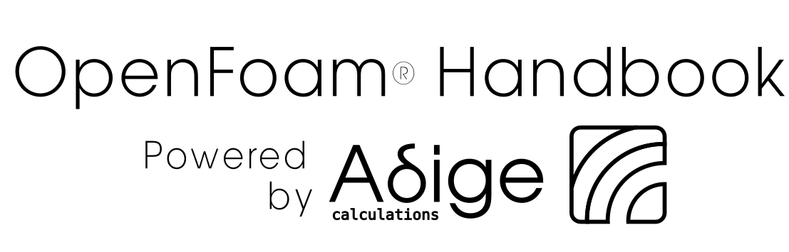

[](https://www.adigecalculations.com/)

## Web site:
--------------------------------------
[](http://openfoam-handbook.adigecalculations.com/)

<!-- The book can be consulted at this link:  https://openfoam-handbook.adigecalculations.com -->
## What this book is all about?
----------------------------------------
This book describes the usual practices a medium/advanced OpenFoam® user
takes during CFD smulations workflows. Shortcuts and support are given for the every-day
use.
It should be seen as a co-pilot to remember commands or take inspiration
for your CFD workflow, instead of a place to study on.

## Build the book
--------------------------------------
To build the book on you local machine, the Rust toolchain must be previously installed,
the package you need to build the book is called ```mdbook```. Follow the instruction to
build the book

```sh
cargo install mdbook
mdbook build
# To serve it in local
mdbook serve
```
