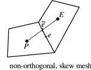

# checkMesh

checkMesh will check for:

  - Mesh statistics
  - Topology
  - Geometry and mesh quality (bounding box, cell volumes,
    skewness, orthogonality, aspect ratio, and so on).

To check the most important parameters of the mesh, run the utilities without flags:

```console
checkMesh
```

If checkMesh explicitly generates an error, this error field must be repaired. To check all
the possible measurable parameters of the mesh (often an overkill utilities), and visualise all the fields, run:

```console
checkMesh -allGeometry -allTopology -writeAllFields -writeSets vtk
```

Most of the time, it is impossible to get no errors when we look at all the mesh fields.
A more progmatic way, is to write the field when you encouter an important error,
so you can post-process via ParaView your mesh and check all the defective set of cells, faces
and/or points written to the ``constant/polyMesh/sets/`` directory with the following flags

```console
checkMesh -writeSets vtk
```

It will write Sets and cellZones.

## Most important mesh parameters

Only few parameters between ```Settings``` and ```Topology``` must kept under control to 
produce a sufficient output.

### Settings

The most important parameters to keep under control when we deal with mesh genration are:

|                       | Non orthogonality                 | Skewness                              |
|-----------------------| --------------------------------- | --------------------------------------|
|<b>Rapresentation</b>  |    | |
|<b>Limits</b>          | Not run a case if it is above 80  | Acceptable under 3                    |

Then is very important to check minVolume (if it is negative, check the .stl files or setting)

### Topology

To improve the quality of the mesh try to remove as much as
possible tetrahedra and tet wedges.

## Deletion of bad quality cells

You can delete bad cells if they are not in region of interest, if this
is the case, utilities such as ```setSet``` and ```subsetMesh``` can be
useful tools, otherwise it is strongly advised to re-mesh. Instead, deleting mesh
arbitrarely is usually done via this utilities.

```console
setSet -constant
```

An internal command line will appear, and similar command can be used to
manage bad cells present in your mesh (i.e. concave, underdetermined,
zero volume cells), in the followng commands a zero-volume cells are treated:

```console
# if you want to fix additional cells and with problematic faces you can (i.e. skew, concave, warp faces etc..)
cellSet c0 new cellToCell zeroVolumeCells any
cellSet c0 add faceToCell skewFaces any
cellSet c0 invert && quit
```
Once exited from the internal command line, execute the following
command to overwrite the mesh

```console
subSetMesh c0 -overwrite
```