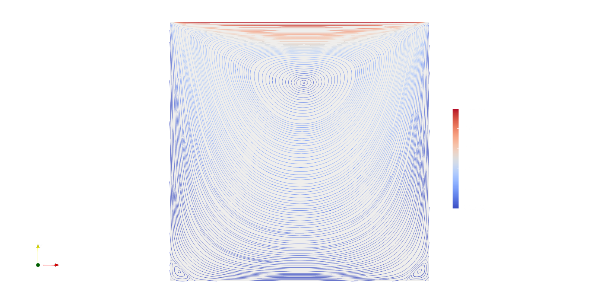

# Filter highlights

Filters menu in paraview can be called using 'ctrl + space'.

## Evenly Spaced Streamline

For streamilines in 2D the filter "Evenly Spaced Streamline", plays a 
good render:

<!--  Script to show the footer   -->
<html>

<body>

</body>
</html>
