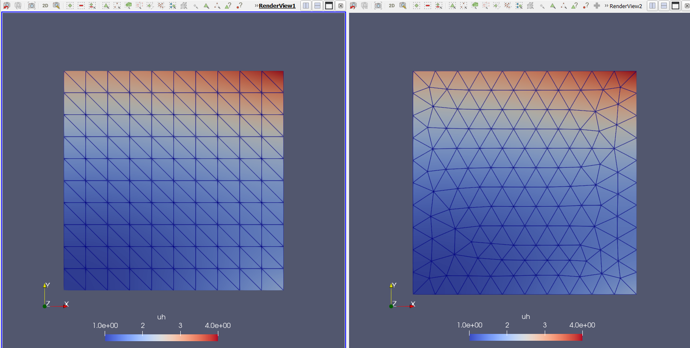

# Visualization over different meshes

Once you have the same domain but with different meshes, often is neeeded a comparison between the 2 solutions. 
mesh. 



The filter (shortcut ```Ctrl``` + ```space-bar```) <b> Resample with Dataset </b> provide a way to interpolate result into a different 


### Check data over a line  

Often it is necessary to display varibale trend over a line. Using the shortcut ```Ctrl``` + ```space-bar``` 
you can rise the filer menu and type <b>Plot over line</b> This will ask to draw a line which is dificult to place.


The best way to use plot over line is through slicing the domain and the slice again the 2D plane on the location
of interest. The filter will automatically recognize the 1D domain resulted by the interesection of two planes.

<!--  Script to show the footer   -->
<html>
<script
    src="https://code.jquery.com/jquery-3.3.1.js"
    integrity="sha256-2Kok7MbOyxpgUVvAk/HJ2jigOSYS2auK4Pfzbm7uH60="
    crossorigin="anonymous">
</script>
<script>
$(function(){
  $("#footer").load("../footers/footer_first_level_depth.html");
});
</script>
<body>
<div id="footer"></div>
</body>
</html>
